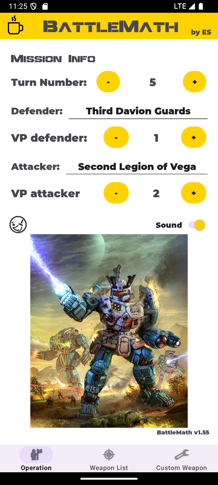
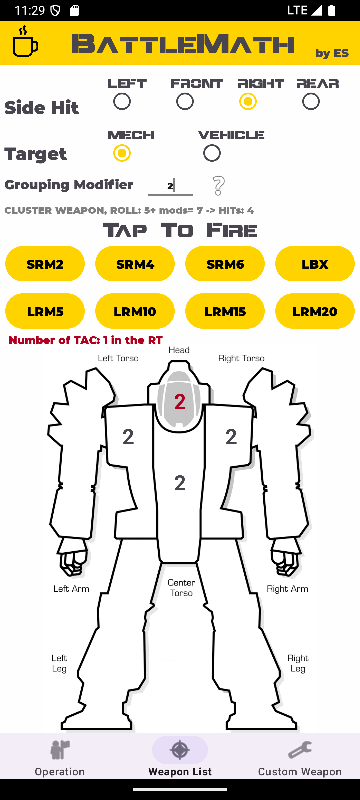
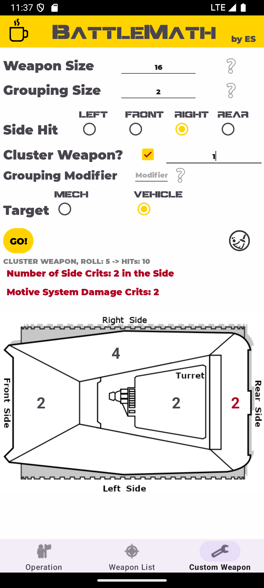

# BattleMath

Android companion application developed in Java to support tabletop gaming sessions.

BattleMath provides digital tools to simplify gameplay operations, automate complex calculations and improve the speed and accuracy of tabletop battles.

The application was designed and developed independently, including application architecture, business logic, Android UI development and source code management.

## Features

### Operation Management

- Track game turns and victory points.
- Configure attacker and defender teams.
- Enable or disable application sounds.

### Weapon Simulation

- Fire predefined weapons with automatic dice rolls and damage calculation.
- Support different target types (Mechs and Vehicles).
- Automatically calculate hit locations, damage distribution and critical hits.
- Display damage results directly on the target interface.

### Custom Weapon Builder

- Create custom weapons by configuring:
  - Weapon size.
  - Grouping size.
  - Cluster behaviour.
- Automatically calculate damage distribution and critical results.

### Audio Feedback

- Weapon-specific sound effects.

## Screenshots
Main application screens showing game management, automatic weapon calculation and custom weapon configuration.

<table>
  <tr>
    <td align="center" valign="top">
      
       
      <strong>Operation Management</strong>
       
      Manage teams, game-turns and victory points during a game session.
    </td>
    <td align="center" valign="top">
      
       
      <strong>Weapon Calculation</strong>
       
      Automatic weapon simulation with hit location, damage and critical hit calculation.
    </td>
    <td align="center" valign="top">
      
       
      <strong>Custom Weapon</strong>
       
      Create custom weapons by configuring parameters and calculating damage results.
    </td>
  </tr>
</table>

## Technologies

- Java 8
- Android Studio
- Android SDK 34
- AndroidX
- Material Components
- View Binding
- ConstraintLayout
- ViewPager2
- Apache POI
- Git

## Architecture

The application was developed independently, covering:

- Application architecture design.
- Business logic implementation.
- Complex calculation algorithms.
- Android user interface development.
- Local data management and file handling.

## Build Requirements

- Android Studio
- JDK 8+
- Android SDK 34

Minimum Android version:

- Android 8.0 (API 26)

## Development Background

BattleMath was created as a personal project to improve Android development skills and gain practical experience in building a complete mobile application.

The project involved:
- Designing a complete mobile application from scratch.
- Implementing non-trivial game logic.
- Developing custom user interfaces.
- Managing source code using Git.

## Disclaimer

BattleMath is an unofficial fan-made project inspired by the BattleTech universe.
BattleTech and related trademarks are property of their respective owners.
Some assets included in this project (such as images, sounds or other media) may belong to their respective copyright holders and are not covered by this project's MIT License.
This project is not affiliated with, endorsed by, or sponsored by the owners of the BattleTech intellectual property.

## License

MIT License